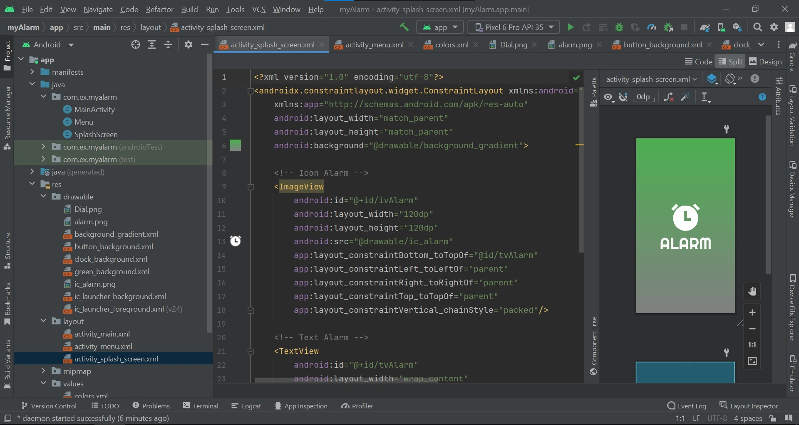
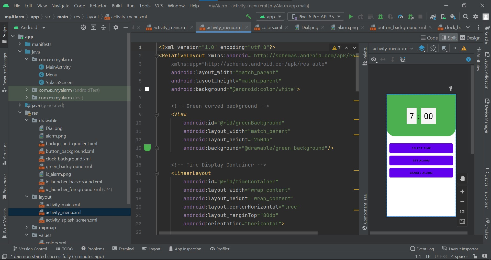
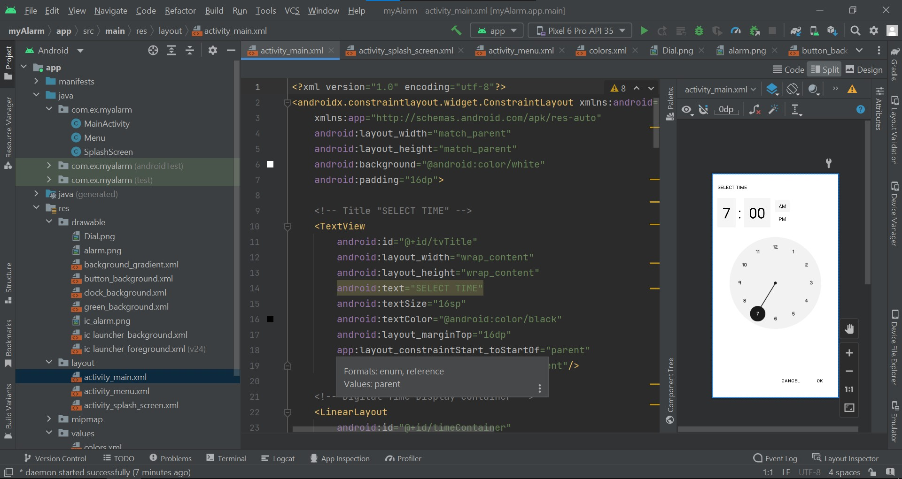

nama    :ferly ardiansyah
kelas   :TI 23 A5
NIM     312310448

Tampilan Awal: Memuat tampilan awal aplikasi dengan ikon jam besar di tengah.

Menu Utama:
Select Time: Tombol untuk memilih waktu alarm.
Set Alarm: Tombol untuk mengatur alarm setelah memilih waktu.
Cancel Alarm: Tombol untuk membatalkan alarm yang telah diatur.

Setting:
Mengatur waktu alarm dengan memilih jam dan menit.
Memilih format waktu AM atau PM.
Menggunakan pilihan tampilan jam analog sebagai alternatif.
